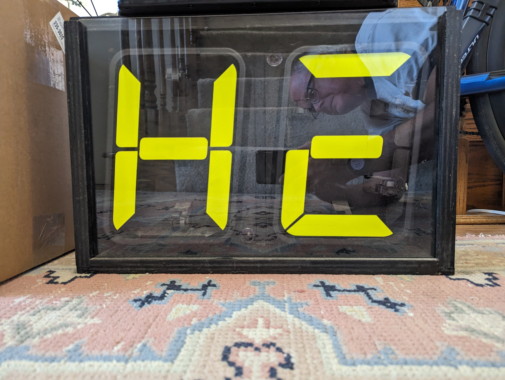
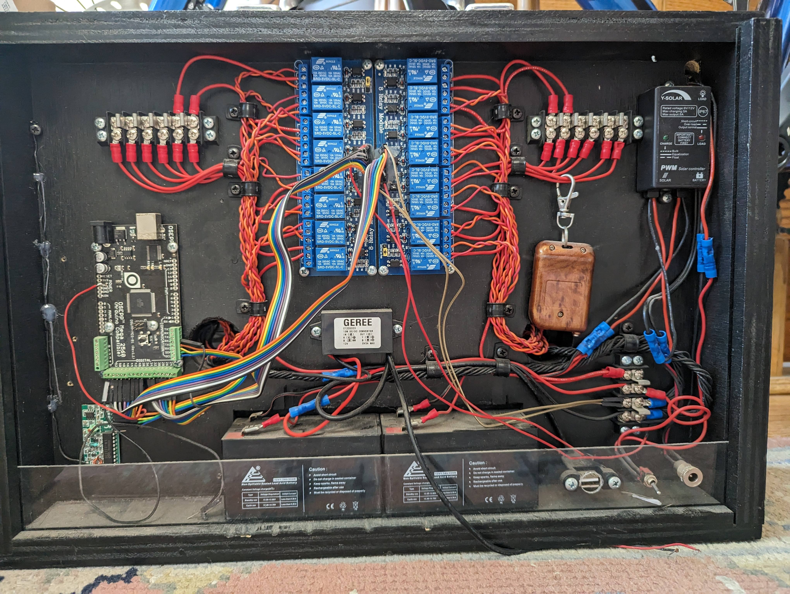

# NCNCA-Lap-Counter
This is an electronic lap counter for use at the finish line of bike (or other) races.  It has two 9" solenoid activated 7-segment digits. It is run by an Arduino controlled by a little remote control with buttons "A," "B," "C," and "D."   It has a solar panel to charge the batteries, but apparently can be powered by an external power supply. 

Mike's son built it as a college project.  There is no documentation.  It's not new, so some of the parts are obsolete.  If I can get it operational, Mike intends to donate it to the NCNCA. 
